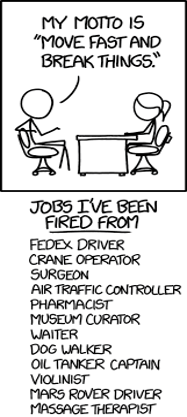

# THE JOY

# OF FUNCTIONAL TESTING

An Introduction with SpecFlow

[JoyOfFunctionalTesting.seankilleen.com](https://JoyOfFunctionalTesting.seankilleen.com/)

---


---

<!-- _footer: "" -->


---

<style scoped>
  ul {
    padding: 0;
    list-style: none;
  }
</style>
<!-- _footer: "" -->


# <!--fit--> Hi! :wave: I'm Sean.

- :bird: [sjkilleen](https://twitter.com/sjkilleen)
- :earth_americas: [SeanKilleen.com](https://seankilleen.com)
- :briefcase: [Excella](https://excella.com)

---

## Let's Do This.

- Why this matters
- Specification by example
- Functional / Acceptance Testing
- Gherkin syntax
- Benefits
- SpecFlow demos

<!-- A note: We're not doing browser-based testing in this talk. -->

---

# Why This Matters

---

<!-- _footer: "" -->


<!-- Breaking things is a luxury we don't have -->

---

#### WHY THIS MATTERS

# Confusion

<!-- What does a requirement mean? -->

<!-- Implicit definitions -->

<!-- Work coming back or causing churn -->

---

#### WHY THIS MATTERS

# Trust

<!-- Regressions erode trust -->
<!-- "Everyone's nervous to touch that" -->
<!-- Stakeholders can't necessarily make sense of automation -->
<!-- Erodes confidence, can destroy pace & feedback loops (waste) -->
<!-- Trust allows us to build meaningful trust for the business -->
---

#### WHY THIS MATTERS

# Feature Fighting

<!-- My term; probably a better term for it. -->

<!-- Building something as a team, breaks because of someone else's requirement -->

<!-- Can be difficult to find; unit testing doesn't catch them. -->

---

<!-- _footer: "" -->


<!-- When lacking collaboration, can be hard to be done -->

<!-- "What about this scenario? My house isn't done because I don't have a pool." -->

<!-- We want to be more explicit to enable collaboration & quick feedback loops -->

---

<!-- _footer: "" -->


---

<!-- _footer: "" -->


<!-- BDD vs Spec by Example -->
<!-- Express intent of system in human understandable terms -->
<!-- One or more real detailed examples to explain functionality -->
<!-- When confused talking to someone, we often say "give me an example" -->

---

## Functional &amp;

## Acceptance Tests

---
<!-- _footer: "" -->


<!-- Ever want to be famous? Invent a box with 4 quadrants. -->

---
<!-- _footer: "" -->


---
<!-- _footer: "" -->


---
<!-- _footer: "" -->


---

<!-- _footer: "" -->


---
<!-- _footer: "" -->


---

# Gherkin Syntax

<!-- A standard of the language of examples -->

---

#### GHERKIN SYNTAX

- Given
- When
- Then

---

#### GHERKIN SYNTAX

Old and busted:

```
A system shall allow login access 
```

---

#### GHERKIN SYNTAX

New hotness:

```
Given I am on the home page
  And I have clicked the login button
When I enter a valid username
  And I enter a valid password
  And I login
Then I should be redirected to my profile page
```

<!-- This is actually telling us:

* Starting State -- clear what the context is
* Written in the first person because there is an actor
* Setting up the universe of the test

Given statement is important for data setup, too

Different opinions -- 1 action? 1 logical action? Many approaches.

Example: Discovering stakeholders want google login.
 -->
---
<!-- _footer: "" -->


<!-- Very specific language here. "Harry Potter" -->
---

# Benefits

---


---

<!-- _footer: "" -->


---

#### BENEFITS

# Consensus

---

#### BENEFITS

# Shift to the Left

<!-- Breaking the cycle of mini-waterfall steps -->

<!-- Breaks the cycle of churn due to late conversation -->

<!-- On the same page early on -->

<!-- Shouldn't be a surprise to anybody -->

---

#### BENEFITS

# Sign-Off

<!-- Smoother sign-off; clear up front -->

<!-- Agreement + Automation == easier to achieve -->

<!-- Trust + Confidence -->
---

#### BENEFITS

# Missed Requirements

<!-- "It's not working because it doesn't also do this other thing we didn't discuss." -->

<!-- Requirements being submitted as bugs -->

<!-- Missed requirements are OK! We can adapt. -->

<!-- If it's missed, we all missed it. -->

<!-- Can do it quickly if possible, or document for later. -->

---
<!-- _footer: "" -->


<!-- 
Benefits system. Handled $7+ billion in assets.
Eligibility/participation engine. A mess. Many different requirements.
Stakeholders not on the same page.
Became a piece of code nobody wanted to touch.
We were forced into a scenario where we had to re-write a lot of the code.

We started asking stakeholders for what things would do.
We listened, and read it back in Gherkin format.
Started with one example, built them up. 
Automated and found a regression right away. Built enthusiasm for participating in the Gherkin generation meetings.
Differences in what stakeholders thought something should do. We could verify what system did.
"What about this?" -- and we could build on initial automation. Adding more examples was trivial. Could process them faster.

Built up to 3500 functional tests & examples. Could implement more complex engine in half the time because we had the confidence of coverage. Plus, we were able to bring everyone along.

Used to be 6 months. Now hours.
 -->

---

# SpecFlow

<!-- Tool in .NET; Cucumber exists elsewhere. -->

<!-- Serve as a glue between human sentences and automated test steps that run -->

<!-- Generates tests in existing test frameworks behind the scenes, e.g. xUnit or NUnit -->
---


<!-- AAT sometimes called AATs. Automated Acceptance Tests -->

---
<!-- _footer: "" -->


---
<style scoped>
  ul {
    padding: 0;
    list-style: none;
  }
</style>
<!-- _footer: "" -->


# Thanks!

- :bird: [sjkilleen](https://twitter.com/sjkilleen)
- :earth_americas: [SeanKilleen.com](https://seankilleen.com)
- :briefcase: [Excella](https://excella.com)
